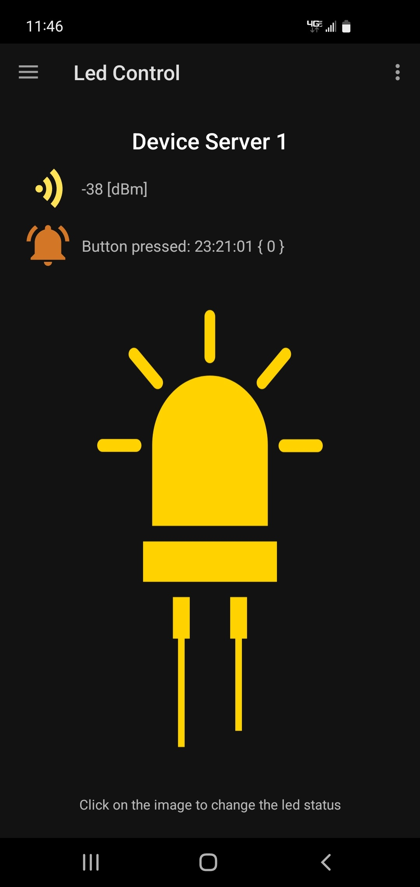
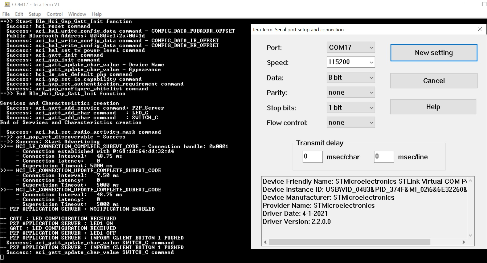

# STM32WBA52-p2p-Server-FreeRTOS

* The STM32WBA52-p2p-Client-FreeRTOS uses FreeRTOS v10.3.1 demonstrating BLE P2P Server example, based on STM32CubeWBA v1.0.0

## Hardware Needed

  * At least [NUCLEO-WBA52CG](https://www.st.com/en/evaluation-tools/p-nucleo-wb55.html) board for running this BLE Server example
  * One BLE Client such as [BLE_p2pClient](https://github.com/STMicroelectronics/STM32CubeWBA/tree/main/Projects/NUCLEO-WBA52CG/Applications/BLE/BLE_p2pClient) using another NUCLEO-WBA52CG or a BLE smartphone app like [ST BLE Sensor](https://play.google.com/store/apps/details?id=com.st.bluems)

## Software Needed

  * Build this project using IAR EWARM v9+

## User's Guide

1) Run this BLE Server project where the STM32WBA52 will advertise

2) Use a BLE Client to connect with this BLE Server to

    a) Notify button press data to BLE Client
    b) Write LED status data to BLE Server

    

3) Use terminal programs like Tera Term to see the logs of each boards via the onboard ST-Link. (115200/8/1/n)

    

## Troubleshooting

**Caution** : Issues and the pull-requests are **not supported** to submit problems or suggestions related to the software delivered in this repository. The STM32WBA52-p2p-Server-FreeRTOS example is being delivered as-is, and not necessarily supported by ST.

**For any other question** related to the product, the hardware performance or characteristics, the tools, the environment, you can submit it to the **ST Community** on the STM32 MCUs related [page](https://community.st.com/s/topic/0TO0X000000BSqSWAW/stm32-mcus).